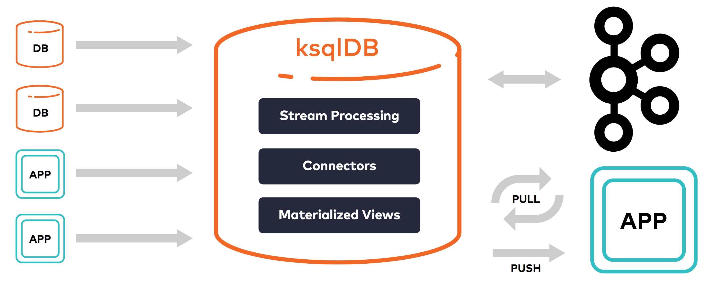

# Let's Learn ksqlDB

## Introduction

[KSQL](https://ksqldb.io/) (recently rebranded ksqlDB—we'll use the two terms interchangably) is an end-to-end **event streaming platform**. During this workshop we'll dig into what that means and why it matters.

In a nutshell, ksqlDB allows you to do the following, all with a familiar SQL syntax:

1. Capture events from source systems (e.g. apps, databases, etc)
2. Perform continuous stateless or stateful transformations on events as they happen
3. Create materialized views from streaming data
4. Directly serve lookups against these materialized views
5. "Sink" data into other downstream systems (e.g. search indexing, caching, data warehousing, etc)

We'll explore all of this functionality during this workshop.

## Setup

The goal of this tutorial is to learn by doing 🎓

First, we'll set up your local system to run Kafka and KSQL.

### Docker

We'll use Docker for installing and running Kafka, KSQL, etc.

macOS users can install Docker via [Homebrew](https://brew.sh/) by running `brew cask install docker`.

Alternatively, you can see the [Docker Community Edition download page](https://hub.docker.com/search?offering=community&type=edition) for other supported operating systems.

#### Docker Memory

Once installed, increase memory available to Docker by opening **Docker Preferences** > **Resources**, adjusting the memory slider to at least 8.0 GiB, and clicking **Apply & Restart**.

You can verify how much memory is available to Docker by running `docker system info | grep -i memory`.

### Confluent Platform

Confluent, a company founded by the team that built [Apache Kafka](https://kafka.apache.org/), provides a broader distribution of Apache Kafka containing additional tooling called **Confluent Platform**. This distribution of Kafka includes the KSQL client and server and is the distribution we'll be using in this tutorial.

Navigate to a base directory where you'll be storing your workshop files, then clone this repo:

```bash
git clone --depth=1 https://github.com/aweagel/ksql_workshop
cd ksql_workshop
```

If you're already running other things in docker locally, I recommend that you **stop them before proceeding**. You can address the currently running containers by running `docker ps`.

We'll use the provided `docker-compose.yml` file to run Apache Kafka, [Confluent Control Center](https://www.confluent.io/confluent-control-center/) (a GUI for managing Kafka deployments), and the KSQL CLI and server.

You can spin up these components as follows:

```bash
docker-compose up -d --build \
  broker \
  control-center \
  ksql-cli \
  ksql-server
```

When the above completes, verify services are running:

```bash
docker-compose ps
```

## Exploring Confluent Control Center

Control Center is a powerful GUI that lets you manage one or more Kafka deployments in a centralized place. Let's take a quick tour.

To open Confluent Control Center, visit the following URL (may take a minute or two to initialize):

http://localhost:9021/

The **Clusters** page should look like this:


Click into the cluster named `controlcenter.cluster`.

On the **Overview** tab, note the high-level details provider about brokers, topics, Kafka Connect, and KSQL.

On the **Brokers** tab, note all the detailed information about production, consumption, partitioning, replication, disk usage, network usage, etc.

On the **Topics** tab, note the list of topics along with the ability to create new topics and manage existing ones.

Click through the other tabs as well and note the other details about your cluster that are available.

## ksqlDB

Let's now dive into ksqlDB. ksqlDB is an "event streaming database purpose-built for stream processing applications" that sits on top of Apache Kafka.

But what does that mean? Let's find out.

### Architecture


#### KSQL Server

KSQL has a client/server architecture. The server component is internally just a generically-written JVM application leveraging the robust [Kafka Streams](https://kafka.apache.org/documentation/streams/) API. This server component exposes a REST API to which clients such as the ksqlDB CLI and the ksqlDB web UI (part of Confluent Control Center) can send queries. The ksqlDB server interprets and executes incoming SQL queries, "processing, reading, and writing data to and from the target Kafka cluster" via the Kafka Streams DSL.

Run `docker ps`. You'll notice that in our case a single container based on the KSQL server docker image is running locally. Like any Kafka Streams application, the KSQL server can easily be scaled horizontally by simply deploying additional containers/nodes.

This point bears re-emphasis: The ksqlDB server is _stateless_, meaning no permanent state is stored in ksqlDB itself. Although by default ksqlDB uses [RocksDB](https://rocksdb.org/) internally to store short-term application state (with other adapters such as an in-memory hash map also available), **all long-term data persistence and replication happens within the attached Kafka brokers**. This is how we're able to spin ksqlDB Server instances up and down without risking data integrity, the same way we would with a traditional Kafka Streams application.

#### KSQL CLI

KSQL provides an interactive command line interface (CLI) that can also been started via docker. In our case one such instance is already running (see `docker-compose ps`).

Let's try it out. Exec into the running `ksql-cli` service by running `docker-compose exec ksql-cli ksql http://ksql-server:8088`. You should be greeted with a prompt that looks like this:

```
                  ===========================================
                  =        _  __ _____  ____  _             =
                  =       | |/ // ____|/ __ \| |            =
                  =       | ' /| (___ | |  | | |            =
                  =       |  <  \___ \| |  | | |            =
                  =       | . \ ____) | |__| | |____        =
                  =       |_|\_\_____/ \___\_\______|       =
                  =                                         =
                  =  Streaming SQL Engine for Apache Kafka® =
                  ===========================================

Copyright 2017-2019 Confluent Inc.

CLI v5.4.1, Server v5.4.1 located at http://ksql-server:8088

Having trouble? Type 'help' (case-insensitive) for a rundown of how things work!

ksql>
```

To verify that everything is wired up appropriately, run the `SHOW TOPICS;` command. You should see output similar to the following:

```
ksql> SHOW TOPICS;

 Kafka Topic                                                                                   | Partitions | Partition Replicas
---------------------------------------------------------------------------------------------------------------------------------
 _confluent-command                                                                            | 1          | 1
 _confluent-controlcenter-5-4-1-1-actual-group-consumption-rekey                               | 1          | 1
 _confluent-controlcenter-5-4-1-1-aggregate-topic-partition-store-changelog                    | 1          | 1
 _confluent-controlcenter-5-4-1-1-aggregatedTopicPartitionTableWindows-ONE_MINUTE-changelog    | 1          | 1
 _confluent-controlcenter-5-4-1-1-aggregatedTopicPartitionTableWindows-ONE_MINUTE-repartition  | 1          | 1
 _confluent-controlcenter-5-4-1-1-aggregatedTopicPartitionTableWindows-THREE_HOURS-changelog   | 1          | 1
 _confluent-controlcenter-5-4-1-1-aggregatedTopicPartitionTableWindows-THREE_HOURS-repartition | 1          | 1
 _confluent-controlcenter-5-4-1-1-AlertHistoryStore-changelog                                  | 1          | 1
 _confluent-controlcenter-5-4-1-1-cluster-rekey                                                | 1          | 1
 _confluent-controlcenter-5-4-1-1-expected-group-consumption-rekey                             | 1          | 1
 _confluent-controlcenter-5-4-1-1-group-aggregate-store-ONE_MINUTE-changelog                   | 1          | 1
 _confluent-controlcenter-5-4-1-1-group-aggregate-store-THREE_HOURS-changelog                  | 1          | 1
 _confluent-controlcenter-5-4-1-1-Group-ONE_MINUTE-changelog                                   | 1          | 1
 _confluent-controlcenter-5-4-1-1-group-stream-extension-rekey                                 | 1          | 1
 _confluent-controlcenter-5-4-1-1-Group-THREE_HOURS-changelog                                  | 1          | 1
 _confluent-controlcenter-5-4-1-1-KSTREAM-OUTEROTHER-0000000105-store-changelog                | 1          | 1
 _confluent-controlcenter-5-4-1-1-KSTREAM-OUTERTHIS-0000000104-store-changelog                 | 1          | 1
 _confluent-controlcenter-5-4-1-1-metrics-trigger-measurement-rekey                            | 1          | 1
 _confluent-controlcenter-5-4-1-1-MetricsAggregateStore-changelog                              | 1          | 1
 _confluent-controlcenter-5-4-1-1-MetricsAggregateStore-repartition                            | 1          | 1
 _confluent-controlcenter-5-4-1-1-monitoring-aggregate-rekey-store-changelog                   | 1          | 1
 _confluent-controlcenter-5-4-1-1-monitoring-message-rekey-store                               | 1          | 1
 _confluent-controlcenter-5-4-1-1-monitoring-trigger-event-rekey                               | 1          | 1
 _confluent-controlcenter-5-4-1-1-MonitoringMessageAggregatorWindows-ONE_MINUTE-changelog      | 1          | 1
 _confluent-controlcenter-5-4-1-1-MonitoringMessageAggregatorWindows-ONE_MINUTE-repartition    | 1          | 1
 _confluent-controlcenter-5-4-1-1-MonitoringMessageAggregatorWindows-THREE_HOURS-changelog     | 1          | 1
 _confluent-controlcenter-5-4-1-1-MonitoringMessageAggregatorWindows-THREE_HOURS-repartition   | 1          | 1
 _confluent-controlcenter-5-4-1-1-MonitoringStream-ONE_MINUTE-changelog                        | 1          | 1
 _confluent-controlcenter-5-4-1-1-MonitoringStream-ONE_MINUTE-repartition                      | 1          | 1
 _confluent-controlcenter-5-4-1-1-MonitoringStream-THREE_HOURS-changelog                       | 1          | 1
 _confluent-controlcenter-5-4-1-1-MonitoringStream-THREE_HOURS-repartition                     | 1          | 1
 _confluent-controlcenter-5-4-1-1-MonitoringTriggerStore-changelog                             | 1          | 1
 _confluent-controlcenter-5-4-1-1-MonitoringVerifierStore-changelog                            | 1          | 1
 _confluent-controlcenter-5-4-1-1-TriggerActionsStore-changelog                                | 1          | 1
 _confluent-controlcenter-5-4-1-1-TriggerEventsStore-changelog                                 | 1          | 1
 _confluent-license                                                                            | 1          | 1
 _confluent-metrics                                                                            | 12         | 1
 _confluent-monitoring                                                                         | 1          | 1
 _schemas                                                                                      | 1          | 1
 docker-connect-configs                                                                        | 1          | 1
 docker-connect-offsets                                                                        | 25         | 1
 docker-connect-status                                                                         | 5          | 1
---------------------------------------------------------------------------------------------------------------------------------
```

Congratulations! You've executed your first KSQL query. Although this is about the most uninteresting query we could have run, it serves its purpose of showing us how to interact with the ksqlDB server via the CLI.

Type `exit` to leave the CLI.

#### KSQL Web UI

The ksqlDB web UI is accessible by visiting the **KSQL** tab in Confluent Control Center. The KSQL web editor comes with helpful features like inline autocompletion, but otherwise behaves similarly to the command line client. We'll be using the web UI for the remainder of this tutorial.

To get familiar with the web UI, visit the the **KSQL** tab in Control Center and run the same `SHOW TOPICS;` query from above. You should see simliar output, only this time displayed in JSON format instead of tabular format.

## Generating and Inspecting Data

Let's make things more interesting by generating some data to work with.

```bash
docker-compose run --rm --name datagen-users ksql-datagen \
  ksql-datagen \
    bootstrap-server=broker:29092 \
    quickstart=users \
    format=json \
    topic=workshop-users \
    maxInterval=250
```

You should see a bunch of event data for user records getting generated in this format:

```plaintext
User_5 --> ([ 1494879914375 | 'User_5' | 'Region_6' | 'FEMALE' ]) ts:1587048249271
User_1 --> ([ 1497959368005 | 'User_1' | 'Region_5' | 'FEMALE' ]) ts:1587048249320
User_8 --> ([ 1491623745164 | 'User_8' | 'Region_5' | 'FEMALE' ]) ts:1587048249380
User_9 --> ([ 1513728641554 | 'User_9' | 'Region_5' | 'OTHER' ]) ts:1587048249426
User_5 --> ([ 1514210541766 | 'User_5' | 'Region_7' | 'MALE' ]) ts:1587048249522
...
```

Now if you look in the **Topics** tab in Control Center you should see the `workshop-users` topic in the list.

You can inspect the messages in this topic by clicking into it within the **Topics** tab, but let's see how to do the same with KSQL.

Head back to the **KSQL** tab. To view the records in our newly created `workshop-users` topic in a one-off fashion, run the following query:

```sql
PRINT 'workshop-users' FROM BEGINNING;
```

Notice that after clicking the `Run` button, it goes into a disabled state and the `Stop` button is activated. That's your first hint that this is a **continuous query**.

The JSON keys from the original messages have been converted into headers for the table in the UI. If you prefer to view the raw JSON, in the top-right of the list you can toggle a raw list view.

## Streams and Tables

In KSQL, there are two related concepts: **streams** and **tables**. The definitions in the Streams and Tables tabs of the Control Center web UI provide an excellent high-level introduction:

"A stream is an unbounded sequence of structured data ('facts') that you can run queries against. Streams can be created from a Kafka topic or derived from an existing stream."

"A table is a view of a stream, or another table, and represents a collection of evolving facts that you can run queries against. Tables can be created from a Kafka topic or derived from existing streams and tables."

An important note about tables is that they are only queryable when they are **materialized**:

"In ksqlDB, a table can be materialized into a view or not. If a table is created directly on top of a Kafka topic, it's not materialized. Non-materialized tables can't be queried, because they would be highly inefficient. On the other hand, if a table is derived from another collection, ksqlDB materializes its results, and you can make queries against it."

We'll work extensively with streams and tables in the steps below.

## Creating a Stream

To get a feel for this, let's create a stream from a topic. From the **KSQL** tab in Control Center, go to the **Streams** tab. Click **Add a stream**. Click the `workshop-users` topic. Notice how the interface recognizes the structure of the data in our topic and auto-populates the stream name, field names, and field types for us.

One thing this interface _cannot_ do, however, is make decisions for us about the `Encoding` and the `Key` for the stream, which will be output to its own Kafka topic. Choose `JSON` and `userid` for these fields, respectively, then click **Save Stream**.

To prove to ourselves that this worked, let's perform a one-off query against our `WORKSHOP_USERS` stream. In the **Editor** tab, run the following:

```sql
SELECT * FROM WORKSHOP_USERS EMIT CHANGES;
```

If you're familiar with SQL, only the last two words will be unfamiliar. `EMIT CHANGES` is special syntax to indicate that a query is continuous and the results should be emitted in an ongoing fashion.

After running the query above, you should see the latest data being produced by `ksql-datagen` flowing into the web UI like magic ✨

Also notice the special `ROWTIME` and `ROWKEY` columns, which are included on every event in a KSQL stream.

## Creating a Table

Let's create a table to get a feel for how those work in KSQL. Rather than creating a table directly from a topic, we'll create a materialized table so we can query against it. And instead of creating our table in the UI as we did earlier for our `WORKSHOP_USERS` stream, let's create our table using a query.

From the **Editor** tab, enter the following SQL:

```sql
CREATE TABLE WORKSHOP_USERS_TBL AS
SELECT wu.userid, count(*) AS event_count
FROM WORKSHOP_USERS wu
GROUP BY wu.userid;
```

Now run the following query to continually observe the changes to the `User_1` record:

```
SELECT * FROM WORKSHOP_USERS_TBL WHERE ROWKEY = 'User_1' EMIT CHANGES;
```

Notice that, as with the stream example, the **Run** button becomes de-activated and the query runs continuously. However, since we are operating against a table instead of a stream we see the latest value for a given `ROWKEY` rather than all the events that have happened to that row.

Let's try an non-continuous query against the same table (no `EMIT CHANGES`). Run the following a few times:

```
SELECT * FROM WORKSHOP_USERS_TBL WHERE ROWKEY = 'User_1';
```

Notice that this query immediately returns its results and closes the connection, much like a traditional query to a RDBMS. This is an example of a so-called **pull query**, as opposed to the **push query** above that constantly emits new results.

## Performing Continuous Stateless Transformations

In stream processing, there are **stateless** operations, such as filtering out records based on some criteria, and **stateful** operations, such as keeping a running average of a particular metric.

Let's perform a handful of stateless transformation on the `WORKSHOP_USERS` stream using a single query.

KSQL provides a variety of [scalar functions](https://docs.confluent.io/current/ksql/docs/developer-guide/syntax-reference.html#scalar-functions) for precisely this purpose. We'll use the `UCASE` and `LCASE` scalar functions to demonstrate how stateless transformations work.

We'll also use the familiar SQL `WHERE` clause to perform some filtering while we're at it.

On the **Editor** tab, run the following query:

```sql
SELECT UCASE(wu.userid) AS userid_upcase, LCASE(wu.regionid) AS regionid_downcase, UCASE(wu.gender) AS gender_upcase
  FROM WORKSHOP_USERS wu
  WHERE wu.gender = 'FEMALE'
  EMIT CHANGES;
```

Notice the real time results that come flowing into the web UI.

Rather than just watching things in the UI, we can also **save the ongoing results** of this transformation to their own stream by prepending the previous query with `CREATE STREAM <NAME> AS`:

```sql
CREATE STREAM WORKSHOP_USERS_CASED AS
  SELECT UCASE(wu.userid) AS userid_upcase, LCASE(wu.regionid) AS regionid_downcase, UCASE(wu.gender) AS gender_upcase
  FROM WORKSHOP_USERS wu
  WHERE wu.gender = 'FEMALE'
  EMIT CHANGES;
```

After running the above, click the **Streams** tab to see the newly created `WORKSHOP_USERS_CASED` stream. Click the stream name in the list. You'll see some more details about the stream. Then, click **Query stream**. This is a convenient way to be taken back to the **Editor** tab with the following query pre-populated:

```sql
SELECT * FROM WORKSHOP_USERS_CASED EMIT CHANGES;
```

As with previous queries using `EMIT CHANGES`, these results will flow continuously into the UI as additional data gets generated.

When you're satisfied with all the data dutifully generated by `ksql-datagen`, hit `CTRL-C` to stop the `ksql-datagen` process and clean up the associated container.

## Capturing Events From Source Systems

Let's next explore KSQL's ability to capture events from source systems. For our purposes we'll use a [PostgreSQL](https://www.postgresql.org/) database, but this could be any source system including a message queue, another data store, or even a third party system [such as Salesforce](https://docs.confluent.io/current/connect/kafka-connect-salesforce/index.html).

### Side bar: How does data sourcing and sinking work in KSQL?

All the data sourcing and sinking capability of ksqlDB is powered by [Kafka Connect](https://docs.confluent.io/current/connect/index.html).

At a high level, Kafka Connect is a generic, configuration-driven, horizontally scalable JVM application distributed as part of Apache Kafka that makes it easy to move data into and out of Kafka from other systems such as applications, databases, file systems, caching systems, search indexes, third party systems, etc. You can also write your own connectors, though this has become increasingly unnecessary as the connector ecosystem has grown.

With KSQL, Kafka Connect can be run in an embedded fashion or communicate with a dedicated Kafka Connect cluster. In this tutorial, we spun up a dedicated single-node Connect cluster as part of our Docker Compose setup.

KSQL allows you to set up a working connector with a single `CREATE SOURCE/SINK CONNECTOR` statement. We'll see how this works below.

### Preparing the Source System

Let's first spin up a PostgreSQL docker container.

If you have any other instances of Postgres running on your local machine, make sure to stop them before proceeding.

```bash
docker-compose up -d --build postgres
```

Then, open a `psql` console as follows:

```bash
docker-compose exec postgres psql -U postgres
```

Create a database, create a table, and insert some data:

```sql
CREATE DATABASE ksql_workshop;

-- connect to the database
\c ksql_workshop

CREATE TABLE customers (
  id         serial PRIMARY KEY,
  first_name varchar(255) NOT NULL,
  last_name  varchar(255) NOT NULL
);

CREATE TABLE companies (
  id          serial PRIMARY KEY,
  customer_id integer REFERENCES customers ON DELETE CASCADE NOT NULL,
  name        varchar(255) NOT NULL,
  street      varchar(255) NOT NULL,
  city        varchar(255) NOT NULL,
  state       varchar(255) NOT NULL,
  country     varchar(255) NOT NULL
);
CREATE INDEX ON companies (customer_id);

INSERT INTO customers (first_name, last_name) VALUES
  ('Jay', 'Kreps');
INSERT INTO customers (first_name, last_name) VALUES
  ('Bob', 'Taylor');
INSERT INTO customers (first_name, last_name) VALUES
  ('Dennis', 'Ritchie');

INSERT INTO companies (customer_id, name, street, city, state, country) VALUES
  (1, 'Confluent', '899 W Evelyn Ave', 'Mountain View', 'CA', 'USA');
INSERT INTO companies (customer_id, name, street, city, state, country) VALUES
  (2, 'Xerox PARC', '3333 Coyote Hill Rd #1314', 'Palo Alto', 'CA', 'USA');
INSERT INTO companies (customer_id, name, street, city, state, country) VALUES
  (3, 'Bell Labs', '600 Mountain Avenue', 'Murray Hill', 'NJ', 'USA');

-- leave psql
\q
```

### Wiring up the Source Connector

Now that we have some dummy data in Postgres to work with, let's wire up KSQL to start receiving events from the Postgres source.

On the **KSQL** page of Control Center, head to the **Editor** tab again, and run the following statement to create the source connector:

```sql
CREATE SOURCE CONNECTOR `workshop-pg-source-connector` WITH (
  'connector.class'               = 'io.debezium.connector.postgresql.PostgresConnector',
  'database.dbname'               = 'ksql_workshop',
  'database.hostname'             = 'postgres',
  'database.password'             = 'postgres',
  'database.port'                 = '5432',
  'database.server.name'          = 'workshop_pg',
  'database.user'                 = 'postgres',
  'plugin.name'                   = 'pgoutput',
  'snapshot.mode'                 = 'always',
  'table.whitelist'               = 'public.customers,public.companies',
  'transforms'                    = 'extractKey,extractValue',
  'transforms.extractKey.field'   = 'id',
  'transforms.extractKey.type'    = 'org.apache.kafka.connect.transforms.ExtractField$Key',
  'transforms.extractValue.field' = 'after',
  'transforms.extractValue.type'  = 'org.apache.kafka.connect.transforms.ExtractField$Value'
);
```

After running the command above, the connector will start. To inspect the running connector, click **Connect** on the left side menu and click the **connect-default** cluster in the list. You should see our `workshop-pg-source-connector` connector with a status of `Running`. Click the name of the connector in the list to see status information, settings, and to pause or delete the connector.

Now head back to the KSQL editor. Before running the following queries, click **Add query properties** and set `auto.offset.reset` to `Earliest`. This instructs the underlying consumer groups to start at the earliest offset for the source Kafka topic when it is first created.

Run the following queries to create streams from the events emitted from our `customers` and `companies` Postgres tables, respectively:

```sql
CREATE TABLE CUSTOMERS_TABLE (
    id INTEGER,
    first_name VARCHAR,
    last_name VARCHAR
  )
  WITH (KAFKA_TOPIC = 'workshop_pg.public.customers',
        VALUE_FORMAT='JSON');
```

```sql
CREATE TABLE COMPANIES_TABLE (
    id INTEGER,
    customer_id INTEGER,
    name VARCHAR,
    street VARCHAR,
    city VARCHAR,
    state VARCHAR,
    country VARCHAR
  )
  WITH (KAFKA_TOPIC = 'workshop_pg.public.companies',
        VALUE_FORMAT='JSON');
```

You can inspect the messages flowing into these tables by running a a simple `EMIT CHANGES` style query, as before:

```sql
SELECT * FROM CUSTOMERS_TABLE EMIT CHANGES;
```

## Performing Continuous Stateful Transformations

Technically we've already seen a basic stateful operation in the `count` example above. But let's get a bit more fancy.

A common use case in data pipelines is [normalization and denormalization](https://en.wikipedia.org/wiki/Database_normalization) of data. Let's denormalize the customer data above in order to **index it in real time** for full-text search in [Elasticsearch](https://www.elastic.co/).

We can do this using a **JOIN** query (insert obligatory [Ghostbusters reference](https://ghostbusters.fandom.com/wiki/Cross_the_Streams)).

On the **Editor** tab in Control Center, run the following query:

```sql
SELECT cst.id AS customer_id,
       cst.first_name AS first_name,
       cst.last_name AS last_name,
       cmp.name AS company_name,
       cmp.street AS street,
       cmp.city AS city,
       cmp.state AS state,
       cmp.country AS country
  FROM customers_table cst
  JOIN companies_table cmp ON cst.rowkey = cmp.rowkey
  EMIT CHANGES;
```

You should see customer records, enriched with company information, flow into the web UI.

Let's create a table from the results of this query:

```sql
CREATE TABLE CUSTOMERS_ENRICHED AS
   SELECT cst.id AS customer_id,
          cst.first_name AS first_name,
          cst.last_name AS last_name,
          cmp.name AS company_name,
          cmp.street AS street,
          cmp.city AS city,
          cmp.state AS state,
          cmp.country AS country
  FROM customers_table cst
  JOIN companies_table cmp ON cst.rowkey = cmp.rowkey
  EMIT CHANGES;
```

## "Sinking" Data to Downstream Systems

Now that we've denormalized the data, let's use the [official Elasticsearch sink connector](https://docs.confluent.io/current/connect/kafka-connect-elasticsearch/index.html) to index this data in Elasticsearch.

First, let's start up the docker containers for Elasticsearch and [Kibana](https://www.elastic.co/kibana):

```bash
docker-compose up -d --build elasticsearch kibana
```

Next, let's create the Elasticsearch sink connector via the `CREATE SINK CONNECTOR` query:

```sql
CREATE SINK CONNECTOR `workshop-es-sink-connector` WITH (
  'behavior.on.null.values' = 'delete',
  'connector.class'         = 'io.confluent.connect.elasticsearch.ElasticsearchSinkConnector',
  'connection.url'          = 'http://elasticsearch:9200',
  'schema.ignore'           = 'true',
  'tasks.max'               = '1',
  'topics'                  = 'CUSTOMERS_ENRICHED',
  'type.name'               = 'ksql-workshop',
  'write.method'            = 'upsert'
);
```

Visit http://localhost:5601 to open Kibana. If prompted to view sample data, click **Explore on my own**. Within the **Discover** tab, set the `Index pattern` to `customers_enriched` and click **Next step**. Then click **Create index pattern** and click on the **Discover** tab again:


Sure enough, we've got data in Elasticsearch!

## Exercising the Real-time ETL

Just like that, we've gone and created a real-time [ETL](https://en.wikipedia.org/wiki/Extract,_transform,_load). Let's try out a few different kinds operations upstream and see what happens.

### Inserts

First we'll open `psql` back up:

```bash
docker-compose exec postgres psql -U postgres -d ksql_workshop
```

Then, we'll insert a new record into the `customers` table:

```sql
INSERT INTO customers (first_name, last_name) VALUES
  ('Tim', 'Berners-Lee');
```

Click **Refresh** in Kibana. Notice that nothing changes. This is because we chose an **inner join** in our enrichment step, as opposed to something like a left join. This means that our enrichment step will not emit new events **unless both sides of the join are satisfied**.

So let's insert a corresponding `company` record:

```sql
INSERT INTO companies (customer_id, name, street, city, state, country) VALUES
  (1, 'CERN', 'Espl. des Particules 1, 1211', 'Meyrin', 'Geneva', 'Switzerland');
```

Now if we click **Refresh** in Kibana, we see the enriched record for Tim Berners-Lee show up in real time 🔥

### Updates

Let's suppose all of our customers have decided that they really like the last name Berners-Lee, so much so that they have legally changed their own surnames to `BERNERS-LEE` (yes, in all caps). Let's update the records in our source system:

```sql
UPDATE customers SET last_name = 'BERNERS-LEE';
```

After clicking **Refresh** in Kibana, you'll see that all records have updated appropriately.

It's worth noting that many of the operations along the way occur in a batch fashion, so even bursts of events like this flow through the pipeline very efficiently.

### Deletes

With all these copycats around, let's say that Tim Berners-Lee decides to no longer be a customer:

```sql
DELETE FROM customers WHERE first_name = 'Tim';
```

As you'd expect, the record no longer appears once you click **Refresh** in Kibana.

## Conclusion

Let's take a step back. In this introductory tutorial, we've taken what would normally require an elaborate stream processing system such as the following:


and achieved the same thing with just KSQL, within a matter of minutes:



(The second diagram does not include a downstream data sink, so technically we accomplished even a bit more than what is depicted here).

Some notable things we did **not** have to do:

- Learn a new programming language (it's just SQL)
- Learn a complex DSL (just a thin layer on top of vanilla SQL)
- Learn a new CLI (there's a robust web UI ❤️)
- Deploy/maintain additional complex infrastructure (it's just stateless docker containers)

In sum, we saw that both the learning curve and the operational burden for ksqlDB are extremely minimal. If you're unfamiliar with the broader stream processing ecosystem, this is a Pretty Big Deal™.

I hope that this workshop was instructive and that you find this information useful as you encounter your own data processing use cases in the future.

## Cleanup

You can spin down all the containers from this workshop using `docker-compose stop`.

## FAQ

- Q: Can I commit my KSQL work to a repo rather than running queries interactively in the editor?
  - A: Yes. The interactive editor is just like a [REPL](https://en.wikipedia.org/wiki/Read%E2%80%93eval%E2%80%93print_loop) in a traditional programming environment. It is great for experimentation and development, but for a production-oriented workflow you would commit your changes to a source repository and deploy them in an automated fashion.
- Q: Do I have to manage source/sink connectors through KSQL?
  - A: No. Kafka Connect existed long before the introduction of KSQL and can be managed in other ways (graphically through the UI, through configuration files and environment variables, through Connect's REST API, etc).
- Q: When should I use [Kafka Streams](https://kafka.apache.org/documentation/streams/) vs. KSQL?
  - A: Although KSQL provides a compelling overall package, there are still good reasons to "drop down" to Kafka Streams for certain use cases. After all, Kafka Streams is a very mature library, and all of KSQL's stream processing power is ultimately built upon Kafka Streams. There are also several features in Kafka Streams that have not been built into KSQL yet. Furthermore, when using Kafka Streams you have the ability to write full programs with arbitrary business logic rather than being limited to KSQL's query language (though [UDFs, UDAFs, and UDTFs](https://docs.confluent.io/current/ksql/docs/developer-guide/udf.html) blur this line). So if your use case is better served by the maturity and customizability of Kafka Streams, there is certainly no issue with using Kafka Streams directly.
- Q: What about custom functions, windowed joins and aggregations, CI/CD, monitoring, unit testing, etc?
  - A: In this already information-dense introduction, I've chosen not to discuss these and other intermediate-level topics. However, these are topics I'd love to discuss in a future workshop if there is interest!

## References

- [ksqlDB website](https://ksqldb.io/overview.html)
- [ksqlDB documentation](https://docs.confluent.io/current/ksql/docs/index.html)
- [ksqlDB cookbook](http://confluent.io/stream-processing-cookbook/)
- [Kafka: The Definitive Guide](https://www.confluent.io/resources/kafka-the-definitive-guide/) - An excellent (free) book on Apache Kafka

## Feedback

If you found this tutorial useful or have other feedback, I'd love to [hear from you](https://twitter.com/arthurweagel).
